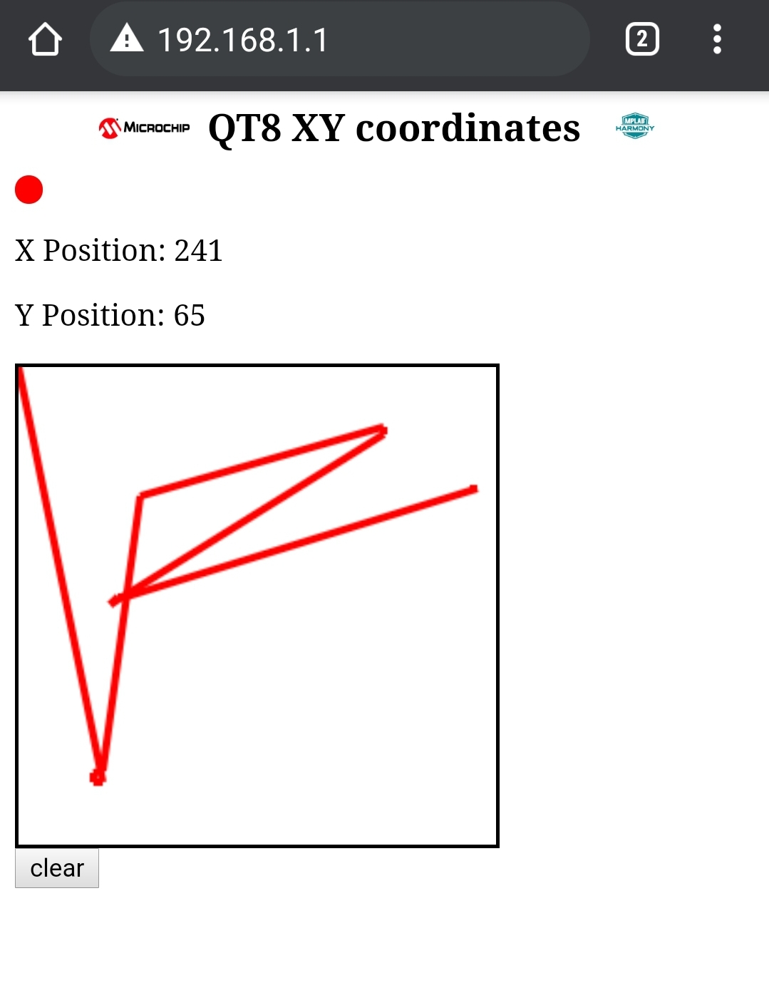

# PIC32MZW1 Reference Design OOB Demo

[](https://github.com/MicrochipTech/PIC32MZW1_refDesign_OOB/releases/latest)
[](https://github.com/MicrochipTech/PIC32MZW1_refDesign_OOB/releases/latest)


```diff
- The demo should only be programmed into a reference design board with an A1 silicon
```
</br>

This repository contains the code, tools and documentation for the Out of Box demo for the [PIC32MZW1](https://www.microchip.com/en-us/products/wireless-connectivity/embedded-wi-fi/pic32mz-w1-wi-fi-soc-and-module-family) chip-down reference design board.

The demo showcases the capabilities of the reference design board to act as a softAP while hosting an HTTP server and monitoring user touch inputs to the [QT8 XPro board](https://www.microchip.com/DevelopmentTools/ProductDetails/PartNO/AC164161) using the enhanced CVD peripheral of the onboard PIC2MZW1. Transformed touch coordinates are also displayed on the OLED B Click board. You can see the demo in action in the GIF below.

<div style="text-align:center"></div>

<br/>

> :information_source: &nbsp; **Note**: The webpage performs AJAX polling for the current touch position every 200ms. The displayed drawing is not representative of the touch accuracy.

## Demo Setup

- Flash the demo image into the PIC32MZ W1 Reference design board
- Plug in the QT8 board into the XPRO header
- Optionally plug in the [OLED B click board](https://www.mikroe.com/oled-b-click) into the microbus connector
    - :information_source: &nbsp; ***Note:*** Make sure that the SDA pin of the OLED B board is bent outwards or removed before plugging it into the microbus interface.
- Optionally, connect a USB-UART converter to the `UART` Jumper to see the demo logs
    - ***Settings:*** 115200 8N1
- Supply power to the board through the `USB POWER` connector using a micro USB cable.
- The board boots up in softAP mode with SSID `DEMO_AP_SOFTAP` and password `password`.
- Connect a laptop or Mobile phone to the board's softAP.
- Open a modern browser that supports HTML5 in the device connected to the board's softAP and navigate to `192.168.1.1`.

<div style="text-align:center"></div>

- Touch on the QT8 board with a single finger
    - The LEDs on the QT8 board indicates the registered touch position
    - If a OLED B click board board is plugged in, the LED coordinates will be displayed on it.
    - The device webpage in the browser will show the registered touch position. A  touch position tracker line will also be updated. 
- Touch on the QT8 board with 2 fingers
    - The corner LED on the QT8 board will light up to indicate that a 2 finger touch has been registered.
    - The touch position tracker line in the device webpage will be cleared.


In case of questions or to provide feedback, please contact [Microchip support](http://microchip.com/support)

____

[](https://www.youtube.com/user/MicrochipTechnology)
[](https://www.linkedin.com/company/microchip-technology)
[](https://www.facebook.com/microchiptechnology/)
[](https://twitter.com/MicrochipTech)

[]()
[]()
